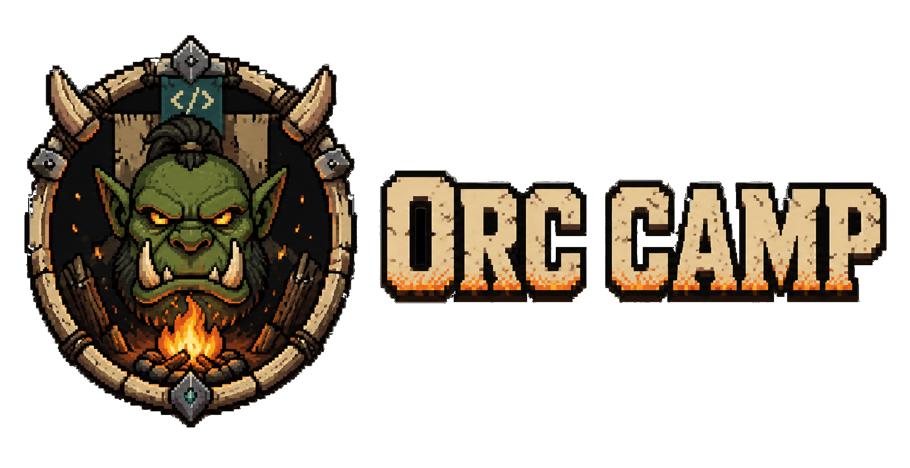

<p align="center">
  
</p>

<p align="center">
  <b>A command-line AI-agent orchestration tool</b><br>
  Visualizes running <b>tmux sessions</b> as <b>camps</b> and the AI-agent sessions inside them (Claude Code · Codex) as <b>orcs</b>.
</p>

<p align="center">
  <a href="#install">Install</a> ·
  <a href="#run">Run</a> ·
  <a href="#commands">Commands</a> ·
  <a href="#license">License</a>
</p>

---


# Orc Camp

**Orc Camp** is a **local-first CLI dashboard** for observing many AI coding agents at a glance.
It visualizes the **tmux sessions** you already have running as *camps*, and the **Claude Code · Codex (and other CLI agent) terminal sessions** inside them as *orc characters* — so you can tell, on a single pixel-game screen, which agent is working, what it's doing, and which one is stuck.

Everything is **read-only** and runs **locally only**. It never modifies tmux, and terminal contents, paths, and secrets are masked in one place before display and are never written to disk.

## Overview

### Core concepts

| Concept | Meaning |
| --- | --- |
| **Camp** | A single tmux session (a project, a batch of work, an experiment) |
| **Orc** | An AI-agent session running inside a pane/window (Claude Code · Codex · other CLI agents) |
| **Campfire Dashboard** | The localhost web dashboard that opens when you run `orc-camp` |
| **Prestige Tier** | The more cumulative LLM usage (or session lifetime) an orc racks up, the fancier it looks — T0 → T1 → T2 → T3 |

### Key features

- 🔎 **Read-only discovery + status inference** — sweeps tmux sessions/windows/panes, fingerprints AI agents, and infers `active` / `waiting` / `idle` / `stale` / `error` / `terminated` with a confidence score (it never asserts a status it can't back up).
- 🖥️ **Local dashboard** — a localhost SPA that shows the camp list and orc statuses as a pixel map. Protected by a `127.0.0.1` bind + a one-time startup token.
- 🛡️ **Privacy-first** — every capture / command line / path passes through redaction before it's consumed, and the originals never land in a file, log, or JSON output.
- 🏆 **Character prestige tiers** — the more an orc works (cumulative tokens, or process uptime when that can't be measured), the more its appearance is upgraded, step by step.
- 📦 **Minimal runtime dependencies** — the CLI/server use only Node built-ins plus `ws`.

## Requirements

- **Node.js ≥ 20** (LTS)
- **tmux** (macOS · Linux) — the thing being observed. If it isn't installed, `orc-camp` reports "no tmux" without erroring.
- **git** (only for a from-source install)

## Install

The published packages are the primary install path:

```bash
npm install -g orc-camp            # core CLI + bundled dashboard
npm install -g orc-camp-assets     # optional: real pixel-art sprites (see below)
```

Then run it from anywhere:

```bash
orc-camp            # start the local server and open the dashboard
```

The core `orc-camp` package is code-only and lightweight. The pixel-art asset pack ships as a **separate, optional package** — see [Pixel assets](#pixel-assets-sprites).

### From source (development)

```bash
git clone https://github.com/hwangjongtaek/orc-camp.git
cd orc-camp
npm install                      # CLI/server dependencies
```

`npm run build` produces a **single self-contained artifact** — it bundles the CLI + local server into `dist/main.js` and builds the dashboard SPA into `dist/dashboard/` (web dependencies are installed automatically). The server serves those static assets directly, so no separate build step is needed:

```bash
npm run build                    # dist/main.js + dist/dashboard/ (single installable)
npm install -g .                 # (optional) make `orc-camp` available everywhere
```

## Run

The fastest way during development is the dev scripts — `tsx` runs the TypeScript directly, so no build is required:

```bash
# 1) Read-only discovery (straight in the terminal, no dashboard)
npm run scan                     # human-readable table
npm run scan -- --json | jq .    # machine-readable JSON
npm run scan -- --watch 3        # re-scan every 3s (NDJSON when --json)

# 2) Dashboard (local server + auto-open browser)
npm run serve                    # binds 127.0.0.1 and prints a token URL on stdout
npm run serve -- --port 4123 --no-open

# 3) Environment check
npm run doctor                   # 5 health checks (tmux/Node/…); exits 1 on failure
```

If you installed globally, run the same things via `orc-camp [subcommand]`:

```bash
orc-camp            # default: start the server and open the dashboard
orc-camp scan       # read-only discovery
orc-camp doctor     # environment check
```

### Pixel assets (sprites)

The core `orc-camp` package contains **code only** (to stay small). The pixel-art asset pack is distributed as a **separate, optional package, `orc-camp-assets`**; without it the dashboard renders placeholders (silhouettes + gradients). To see the real sprites, install the pack alongside the core:

```bash
npm install -g orc-camp-assets   # the server auto-detects it and serves /asset-pack/*
```

If you have a local pack directory instead (e.g. a source checkout), point at it with an env var:

```bash
ORC_CAMP_ASSET_PACK=/path/to/asset-packs/orc-camp-default orc-camp
```

You can confirm the current detection state via the `installHealth.assetPack*` fields of `orc-camp doctor --json`, and via the `pixel assets: on/off` line in the `serve` startup log.

### Dashboard development (Vite)

When working on the UI, run the API server and the Vite dev server together:

```bash
npm run serve                    # terminal 1: local API server
cd web && npm run dev            # terminal 2: Vite dev server (HMR)
```

## Commands

```
orc-camp [serve] [--port <n>] [--host <addr> [--allow-external]] [--no-open] [--json]
orc-camp scan    [--json] [--watch [interval]]
orc-camp doctor  [--json] [--report [path]]
orc-camp purge   [--yes] [--json]
```

| Command | Description |
| --- | --- |
| `orc-camp` (no args) | Start the local server and open the dashboard in a browser (default) |
| `orc-camp serve` | Run the server only. Binds `127.0.0.1` by default and prints a token URL on stdout. External bind requires `--allow-external` |
| `orc-camp scan` | Read-only discovery, no server. `--json` (JSON), `--watch [seconds]` (periodic re-scan) |
| `orc-camp doctor` | Environment health check. `--json`, `--report [path]` |
| `orc-camp purge` | Remove local config/log data. Dry-run by default; `--yes` actually deletes (for a full removal before uninstall) |

Exit codes: `0` produced a result (partial errors are reported as diagnostics) · `1` fatal failure · `2` usage error.

> **Uninstall**: `npm uninstall -g orc-camp` removes only the code and intentionally keeps config/log (so settings are restored on reinstall). For a complete removal, run `orc-camp purge --yes` **before** uninstalling. The residue never contains any secret or terminal content (the startup token is memory-only, and captured output is never persisted).

## How it works · Security

- **Read-only invariant** — tmux is only ever called through the `list-sessions` / `list-windows` / `list-panes` / `capture-pane` (+ `-V`) allowlist, and no state-changing command is ever spawned. Process introspection (`ps`) also uses a fixed argv with `shell:false`.
- **Privacy chokepoint** — captures, command lines, cwd, and pane titles pass through a single `redact()` boundary before they're consumed. Originals are never stored in a file, log, or `--json` output.
- **Local-first** — the server binds `127.0.0.1` only by default and authenticates with a one-time CSPRNG startup token. External bind requires an explicit `--allow-external` + warning, and there is no automatic telemetry or remote transmission.

See `docs/specs/` (the implementation SSOT) for the detailed contracts.

## Character prestige tiers

The more cumulative LLM tokens/cost an orc consumes (falling back to the agent process **uptime** when that's hard to measure), the more its armor, gear, and `active` flourish are upgraded — **T0 base → T1 → T2 → T3**.

- Of the 5 characters (`orc-high-warchief-mascot` · `orc-claude-storm-shaman` · `orc-codex-field-engineer` · `orc-unknown` · `orc-iron-commander`), **T1 is currently `available`** (8-direction rotation + idle/active/roaming animations), while **T2 · T3 are `staged`** (next up).
- The decision priority is `cumulative tokens → cost → process uptime → base`, and it never guesses when things are ambiguous.
- Design SSOT: `docs/assets/15-Character-State-Model.md` · runtime contract: `docs/specs/SPEC-302-mascot-prestige-tiers.md`.

## Documentation

- **Specs (implementation SSOT)**: [`docs/specs/`](docs/specs/README.md)
- **Product**: [`docs/product/`](docs/product/) — requirements, roadmap, [decision log](docs/product/08-Decisions.md)
- **Design**: [design-system contract](DESIGN.md) · [`docs/design/`](docs/design/)
- **Assets**: [`docs/assets/`](docs/assets/) — PixelLab prompts, registry, character state model

## License

This repository is covered by **two different licenses**.

| Scope | License | File |
| --- | --- | --- |
| **Runtime code** (`src/`, `web/`, `bin/`, `dist/`) | **MIT** | [`LICENSE`](LICENSE) |
| **Pixel-art asset pack** (`asset-packs/` → `orc-camp-assets`) | PixelLab.ai paid-plan terms (**commercial use & redistribution allowed · no attribution required**) | [`asset-packs/orc-camp-default/LICENSE.md`](asset-packs/orc-camp-default/LICENSE.md) |

- The MIT license applies to the **runtime code only**.
- The pixel art in `asset-packs/` was generated on a **paid PixelLab.ai plan**; under the [PixelLab Terms of Service](https://pixellab.ai/termsofservice), **commercial use and redistribution are allowed and no attribution is required** (decision [D-054](docs/product/08-Decisions.md)). It is not MIT, so it is managed under a separate license.
- The assets are not bundled into the core package; they ship as a **separate, optional package, `orc-camp-assets`** (the core stays code-only, preserving the D-009 code⊥asset separation invariant). The dashboard keeps the same layout and interactions with placeholders even when the assets are absent.

© 2026 Orc Camp contributors. Licensed under the MIT License.
