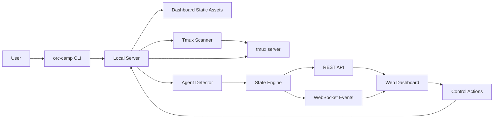

# 10 System Architecture

## Architecture Goal

Orc Camp는 사용자의 local machine에서 tmux session을 발견하고, AI agent session을 식별하며, web dashboard에서 상태 관찰과 제한된 제어를 제공한다. 전체 구조는 terminal context를 외부로 보내지 않는 local-first architecture를 따른다.

## High-level Architecture

## Component Responsibilities

### CLI

- command parsing
- local server startup
- port selection
- browser open 또는 fallback URL 출력
- `scan`, `doctor`, `serve` command 제공

### Local Server

- dashboard static asset serve
- REST API 제공
- WebSocket event stream 제공
- startup token 검증
- scanner lifecycle 관리

### Tmux Scanner

- tmux session/window/pane inventory 수집
- pane output preview capture
- tmux command timeout/error 처리
- snapshot version 생성

### Agent Detector

- pane command, title, cwd, recent output 기반 agent type 판정
- Claude Code/Codex adapter 우선 제공
- status와 confidence 산출
- unknown agent fallback 제공

### State Engine

- 이전 snapshot과 현재 snapshot diff
- camp/orc aggregate 상태 계산
- activity event 생성
- stale state 관리
- terminated pane retention과 cleanup 관리

### Dashboard

- camp list와 camp detail 표시
- pixel camp scene과 orc sprite rendering
- inspector/terminal preview/control dock 제공
- settings와 redaction 상태 표시

## End-to-end Flow

### Launch Flow

1. 사용자가 shell에서 `orc-camp`를 실행한다.
2. CLI가 tmux와 환경을 점검한다.
3. 사용 가능한 localhost port를 선택한다.
4. local server를 시작하고 tokenized dashboard URL을 만든다.
5. browser를 열거나 URL을 stdout에 출력한다.

### Discovery Flow

1. scanner가 tmux inventory command를 실행한다.
2. session/window/pane raw data를 canonical model로 변환한다.
3. detector가 pane별 agent type과 status를 추론한다.
4. state engine이 camp/orc snapshot을 갱신한다.
5. API snapshot과 WebSocket delta가 dashboard로 전달된다.

### Observation Flow

1. 사용자가 camp를 선택한다.
2. dashboard가 camp detail snapshot을 로드한다.
3. camp scene이 orc sprite를 표시한다.
4. 사용자가 orc를 선택하면 inspector가 preview와 metadata를 보여준다.

### Control Flow

1. 사용자가 orc를 선택하고 control action을 입력한다.
2. frontend가 target metadata를 표시하고 위험 action은 confirm을 요구한다.
3. backend가 token과 action allowlist를 검증한다.
4. backend가 tmux target이 여전히 같은 pane id와 agent metadata에 매핑되는지 재검증한다.
5. tmux adapter가 `send-keys` 등 control command를 실행한다.
6. result event가 dashboard activity log에 표시된다.

## Data Model Traceability

| Product Concept | Frontend | Backend | Infra |
| --- | --- | --- | --- |
| Camp | `CampCard`, `CampScene` | `Camp` aggregate | tmux session |
| Orc | `OrcSprite`, `OrcInspector` | `Orc` entity | tmux pane/process |
| Status | `StatusBadge` | state engine enum | scanner/detector output |
| Current Work | `OrcInspector` summary | detector summary + source | pane title/output/prompt |
| Control | `CommandDock` | control API | `tmux send-keys` |
| Preview | `TerminalPreview` | captured/redacted output | `tmux capture-pane` |

## Cross-cutting Concerns

### Security

- localhost binding by default
- startup token for API mutation
- target revalidation before control
- interrupt confirm
- output redaction
- no cloud sync in MVP

### Reliability

- tmux command timeout
- target-level error isolation
- stale snapshot indicator
- terminated/stale state retention
- reconnect strategy for WebSocket
- manual refresh fallback

### Performance

- scan interval configurable
- capture line/byte limit
- camp list summary payload
- WebSocket event batching
- detail payload lazy loading

### Privacy

- preview line count 제한
- current work summary redaction
- output history 저장 opt-in
- debug log에 captured output 미저장
- remote binding opt-in warning

## MVP Architecture Boundary

MVP에 포함:

- local CLI/server
- tmux scanner
- Claude Code/Codex detector
- web dashboard
- status visualization
- text input/interrupt control

MVP에서 제외:

- remote multi-host
- team sharing
- cloud state sync
- agent job scheduler
- persistent full terminal logs

## Architecture Review

- **판정**: 조건부 승인
- **P0 blocker**: 없음
- **P1 보강**: detection threshold, current work summary source, custom redaction, manual mark/unmark 정책을 구현 전 명확히 해야 한다.
- **재검토 시점**: Discovery Prototype 완료 후 실제 tmux/agent session에서 상태 추론 정확도를 측정한 뒤 frontend scope를 확정한다.

## Open Questions

- scanner polling interval default는 얼마가 적절한가?
- agent detector adapter API를 plugin 형태로 열 것인가?
- local persistence를 JSON config로 충분히 시작할 수 있는가, SQLite를 초기에 도입해야 하는가?
- dashboard asset pack을 package 내부에 포함할지 사용자 asset directory로 분리할지 결정해야 한다.
